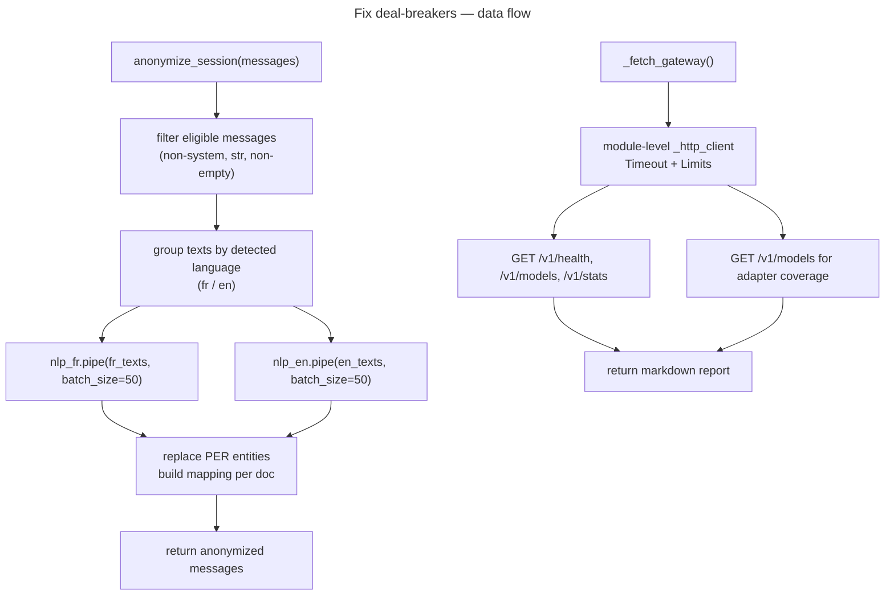

# Fix: spaCy disable=, nlp.pipe() batch, httpx singleton

## Feature

- **Summary**: Correct the 3 deal-breakers flagged by sc-python audit — unused spaCy pipeline components loaded at startup, per-message nlp() calls instead of batch nlp.pipe(), and two per-call httpx.Client instantiations in the playground gateway tab.
- **Stack**: `Python 3.10+`, `spaCy 3.7`, `httpx 0.27`
- **Branch name**: `fix/spacy-httpx-deal-breakers`
- **Parent Plan**: `none`
- **Sequence**: `standalone`
- Confidence: 9/10
- Time to implement: 30-45 min

## Architecture projection

### Files to modify

- `pipelines/anonymization/anonymize.py` - add disable=[...] to both spacy.load() calls and switch anonymize_session to nlp.pipe() per-language batch
- `apps/playground/app.py` - replace double per-call httpx.Client with a module-level singleton client using explicit Timeout and Limits

### Files to create

_(none)_

### Files to delete

_(none)_

## Applicable rules

| Tool   | Name                     | Path                                            | Why it applies                                               |
| ------ | ------------------------ | ----------------------------------------------- | ------------------------------------------------------------ |
| claude | perf-pivots-httpx        | `.claude/rules/07-quality/perf-pivots-httpx.md` | §9 singleton pattern, explicit Timeout/Limits, no per-call client |
| —      | spaCy capability pivot   | _(loaded at audit time, not a project rule)_    | disable= criterion and nlp.pipe() batch criterion            |

## User Journey

## Risk register

| Risk | Impact | Mitigation |
| ---- | ------ | ---------- |
| nlp.pipe() counter ordering broken if batching by language | [PER_N] numbers differ from sequential approach on mixed-language sessions | Build a {original_index: doc} dict from both language batches, then assign counter by iterating range(len(messages)) in original order |
| disable= removes a component that spaCy's NER depends on internally | NER accuracy drops silently | fr_core_news_md: disable morphologizer/parser/attribute_ruler/lemmatizer only; en_core_web_md: disable tagger/parser/senter/attribute_ruler/lemmatizer only; never disable tok2vec (feeds ner) |
| fr_core_news_md has no tagger component | spacy.load() raises ValueError: [E007] at startup | Use model-specific disable lists — French uses morphologizer, not tagger |
| Module-level httpx.Client in Gradio may persist across hot-reloads | Stale client on dev reload | Acceptable — Gradio does full process restart on reload; document in comment |

## Implementation phases

### Phase 1: spaCy — disable unused pipeline components

> Add disable=[...] to both spacy.load() calls so only the ner component is loaded.

#### Tasks

1. Identify the components used: only `ent.label_` and `ent.text` → only `ner` is needed; `tok2vec` must NOT be disabled (feeds ner internally)
2. Add model-specific disable list to `spacy.load("fr_core_news_md", ...)` at line 18: `disable=["morphologizer", "parser", "attribute_ruler", "lemmatizer"]` — French model has no `tagger`
3. Add model-specific disable list to `spacy.load("en_core_web_md", ...)` at line 25: `disable=["tagger", "parser", "senter", "attribute_ruler", "lemmatizer"]`
4. Run `pytest tests/test_anonymize.py -x -q` — must exit 0

#### Acceptance criteria

- [ ] `spacy.load("fr_core_news_md", ...)` uses `disable=["morphologizer", "parser", "attribute_ruler", "lemmatizer"]` (no `tagger`)
- [ ] `spacy.load("en_core_web_md", ...)` uses `disable=["tagger", "parser", "senter", "attribute_ruler", "lemmatizer"]`
- [ ] `tok2vec` is not in any disable list
- [ ] `pytest tests/test_anonymize.py` exits 0

---

### Phase 2: spaCy — batch processing with nlp.pipe()

> Replace the per-message `nlp(text)` call in `anonymize_session` with `nlp.pipe()` per language group.

#### Tasks

1. Refactor `anonymize_session` to collect eligible messages with their original index; detect language per message via `_detect_lang` upfront
2. Build two index lists: `fr_indices` and `en_indices` (original positions); extract corresponding texts
3. Run `_get_nlp_fr().pipe(fr_texts, batch_size=50)` and `_get_nlp_en().pipe(en_texts, batch_size=50)`; store results in `docs: dict[int, Doc]` keyed by original index
4. Adapt `_replace_persons` to accept a pre-computed `doc: Doc` parameter instead of calling `nlp()` internally
5. Assign counter by iterating `range(len(messages))` in original order — pull doc from `docs[i]` — so `[PER_N]` numbering matches the sequential pre-refactor behaviour
6. Run `pytest tests/test_anonymize.py -x -q` — must exit 0

#### Acceptance criteria

- [ ] `anonymize_session` calls `nlp.pipe()` — zero direct `nlp(text)` calls remain in the batch path
- [ ] `_replace_persons` accepts a `doc: Doc` parameter instead of calling `nlp` internally
- [ ] Counter assignment iterates messages in original index order (`range(len(messages))`)
- [ ] `pytest tests/test_anonymize.py` exits 0 and `[PER_N]` numbering matches existing test fixtures

---

### Phase 3: httpx — module-level singleton client

> Replace the two per-call `with httpx.Client()` blocks in `_fetch_gateway` with a single module-level client.

#### Tasks

1. Declare `_http_client: httpx.Client` at module level with `httpx.Timeout(connect=5.0, read=10.0, write=5.0, pool=2.0)` and `httpx.Limits(max_connections=10, max_keepalive_connections=5)`
2. Remove the two `with httpx.Client(timeout=10.0) as client:` blocks from `_fetch_gateway`
3. Merge the second `GET /v1/models` call: capture `models_response = _http_client.get(f"{GATEWAY_URL}/v1/models")` from the loop iteration, store `models_data = models_response.json()` via `json.loads(models_response.text)` for the adapter coverage block — eliminate the duplicate request
4. Replace `except Exception` with `except (httpx.RequestError, httpx.HTTPStatusError, json.JSONDecodeError)` — the adapter parsing block also needs `json.JSONDecodeError` guard

#### Acceptance criteria

- [ ] No `httpx.Client(` instantiation inside `_fetch_gateway`
- [ ] Module-level `_http_client` uses `httpx.Timeout(connect=..., read=..., write=..., pool=...)` (4-field form) and `httpx.Limits(...)`
- [ ] `/v1/models` is fetched only once; its parsed JSON is reused for the adapter coverage block
- [ ] `except Exception` replaced with `except (httpx.RequestError, httpx.HTTPStatusError)` in the loop and `except (httpx.RequestError, httpx.HTTPStatusError, json.JSONDecodeError)` for the adapter parsing block

## Amendments

🤖 Phase 2 — `_replace_persons` conservée avec paramètre `doc: Doc | None = None` (fallback `_nlp_for` quand absent) pour maintenir la compatibilité avec les tests. Rationale: l'implémenteur avait supprimé la fonction, mais les tests l'importent directement. Le batch nlp.pipe() est géré dans `anonymize_session`, `_replace_persons` reste testable en isolation.

🤖 Phase 2 — Tests mis à jour (`tests/pipelines/test_anonymize.py`): (1) patch paths corrigés de `pipeline.anonymize` → `pipelines.anonymization.anonymize` (chemins étaient erronés avant), (2) `TestSessionCoherence` passe maintenant par `_get_nlp_fr`/`_get_nlp_en` avec mock `.pipe()` au lieu de `_nlp_for`, (3) `_make_nlp` supporte `.pipe()` via générateur. Rationale: les anciens patch paths n'atteignaient jamais le module réel.

## Log

## Validation flow demonstration

1. Run `pytest tests/test_anonymize.py -x -v` — all tests pass
2. Check `anonymize.py` — both `spacy.load()` have `disable=[...]`, no `nlp(text)` call in the batch path
3. Check `app.py` — `_http_client` declared at module level, `_fetch_gateway` has no `with httpx.Client(` block
4. Launch the playground (`python -m gradio apps/playground/app.py`) — Gateway tab refreshes without error
